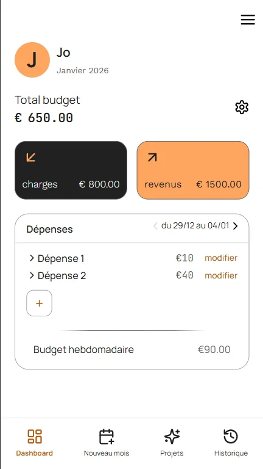
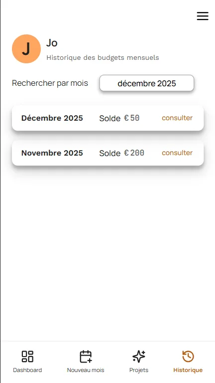
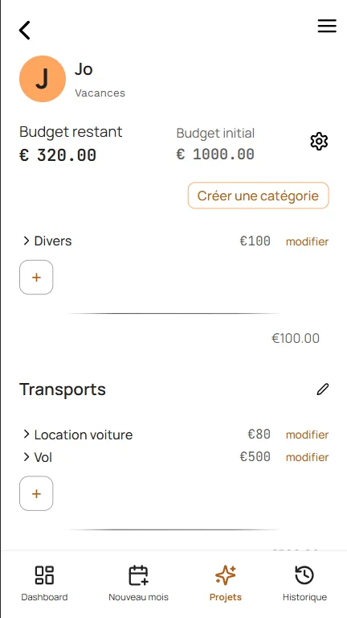

# 💸 MoneyMood

**Application PWA de suivi budgétaire avec vision hebdomadaire**

MoneyMood offre une approche simplifiée de la gestion de budget : définissez vos charges et revenus, suivez vos dépenses semaine par semaine, et gérez des projets spécifiques en parallèle. L'interface mobile-first permet un suivi au quotidien.

🔗 **[Voir la démo live](https://moneymood-ios.vercel.app/)**

---

## 📸 Aperçu

> **Note**: L'interface est pensée en mobile-first. Une version desktop améliorée est en développement.

### Dashboard principal



### Historique des derniers mois



### Interface projet



---

## ✨ Fonctionnalités principales

- **📊 Vue hebdomadaire du budget** : suivi visuel semaine par semaine
- **🎯 Budgets projets dédiés** : gérez des enveloppes spécifiques (vacances, travaux, etc.) en parallèle du budget mensuel
- **📈 Historique détaillé** : retrouvez vos anciens budgets facilement en consultation
- **📱PWA optimisée** : interface mobile-first avec installation possible sur l'écran d'accueil

---

## 🛠️ Stack technique

### Core

- **Architecture**: Monorepo (npm workspaces) - Frontend/Backend/Shared
- **Frontend**: [React 19](https://react.dev) + Vite
- **Backend**: [Express](https://expressjs.com) + Node.js
- **Base de données**: PostgreSQL hébergé sur [Neon](https://neon.tech/)
- **ORM**: [Prisma](https://www.prisma.io/)

### Librairies principales

- **Styling**: Sass (modules CSS)
- **Validation**: Zod (schémas type-safe partagés frontend/backend)
- **State management**: Zustand
- **Cache et requêtes serveurs**: TanStack Query (React Query)

### Tests & Qualité

- **Tests E2E**: Playwright
- **Tests intégration**: Jest
- **CI/CD**: Intégration continue avec tests automatisés

### Infrastructure

- **Déploiement**: Vercel

---

## 🎯 Défis techniques relevés

- **Architecture monorepo** : Configuration de workspaces npm avec package `shared` pour partager types et validations Zod entre frontend/backend
- **Système d'authentification custom** : Implémentation de sessions sécurisées avec tokens cryptographiques (crypto.randomBytes), expiration glissante (rolling sessions) et nettoyage automatique
- **Tests E2E isolés** : Configuration Playwright avec base de données Docker dédiée pour des tests reproductibles sans conflit
- **PWA et mode offline** : Accès en lecture seule aux données mises en cache pour une consultation hors ligne

---

## 🚀 Installation et développement local

### Prérequis

- Node.js 18+
- npm/yarn/pnpm/bun
- PostgreSQL

### Configuration

**1. Installer les dépendances**

```bash
npm install
```

**2. Configurer les variables d'environnement**

Créer les fichiers `.env` dans les worspaces :

`backend/.env` :

```bash
DATABASE_URL="postgresql://..."
```

`frontend/.env` :

```bash
VITE_API_URL=http://localhost:4000
VITE_BASE_URL=http://localhost:5173
```

**3. Builder le package partagé**

```bash
npm run build --workspace=shared
```

**4. Setup de la base de données**

```bash

npx prisma generate --workspace=backend
npx prisma migrate dev --workspace=backend
```

**6. Lancer l'application**

```bash
npm run dev
```

L'application sera accessible sur [http://localhost:5173](http://localhost:5173)

---

### Tests

**Tests d'intégration (Backend) :**

```bash
cd ./backend/
npm run test
```

> Les tests backend utilisent une base de données dédiée. Créez un fichier `.env.test` dans `/backend/` avec un `DATABASE_URL` pointant vers votre base de test.

**Tests E2E (Playwright + Docker) :**

```bash
cd ./e2e/
./test-ci-e2e.sh
```

> Les tests E2E utilisent une base de données PostgreSQL isolée lancée via Docker. Le script démarre automatiquement le container de base de données, puis lance le backend et le frontend localement via la configuration `webServer` de Playwright. Cette approche garantit un environnement de test propre sans polluer la base de développement.

---

## 🗺️ Roadmap

**Expérience utilisateur :**

- [ ] Refonte de l'interface desktop pour une meilleure expérience multi-écrans
- [ ] Mode offline complet avec synchronisation automatique au retour de connexion

**Fonctionnalités :**

- [ ] Graphiques de tendances et visualisation des habitudes de dépenses
- [ ] Catégorisation des dépenses mensuelles

---
